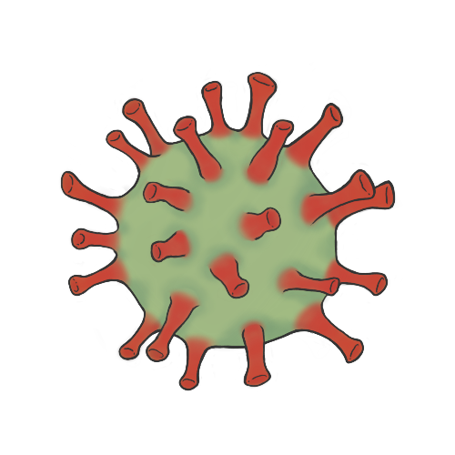
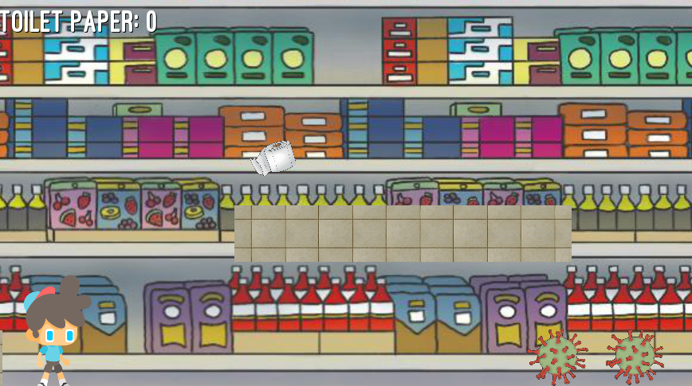
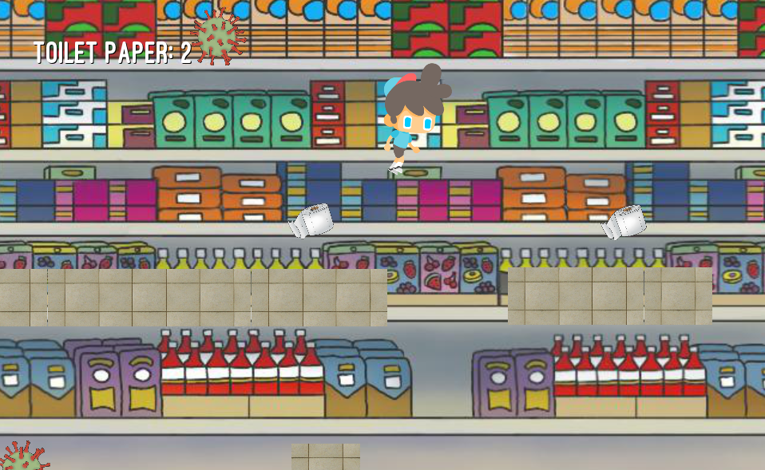

# Supply Run 
## by TP Gang
### For BL-MSCH-C220 at Indiana University, Bloomington
### April 29, 2020

---

This game was developed as a final project for C220 as part of a 48-hour game jam. 
## Game Creation
The theme of the game jam was CoronaVirus. The most prevalent thoughts were people panic-buying toilet paper and masks. The most obvious idea was to make a 2D side-scroller where the player collects toilet paper while avoiding the coronavirus.

## Challenges and Struggles
The biggest issue that affects the feel of the game was moving left and right. Currently, the animated sprites only face right. This works great when the player moves right. However, when the player turns left, the animated sprite continues to face right and looks like they're moon-walking.\
The fix for this issue is usually simple: reverse the animated sprite for the left movement with "flip-h = true".
Unfortunately, this fix only works if the character *inside* the animated sprite is *centered*. Our character inside the animated sprite is offset to one side. Therefore, when reversing the sprite, the character flips to the other side and creates the effect of teleportation. 
The only fix would be to manually fix every sprite frame to move the character towards the center. This fix is time-consuming as we have 40+ frames of sprites.

## Technologies and Resources Used 
Game engine: Godot \
Original art: Casey Luthman
Sprites: gameart2d.com and clipart.com \
Sounds: freesound.org 

## Objective of the Game
The goal of the game is to collect the most amount of toilet paper without touching the virus. This will be challenging as the virus spawns every few seconds. You'll win the game if you can make it to the exit!

## How to Play
The player is controlled with A as left, W as jump, and D as right.

## Future plans
For the future, we would like to add masks and gloves which prevent the player from dying immediately. \
For issues, new animated sprites will be used that are centered, not offset.

---

### Team Members

  * Murun T
    * Programming and repository maintainer
  * Casey Luthman
    * Original Art
  * Destiny Chamorro
    * Title and End Screen
  * Hongbo Na
    * QA Testing

